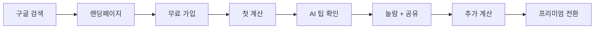
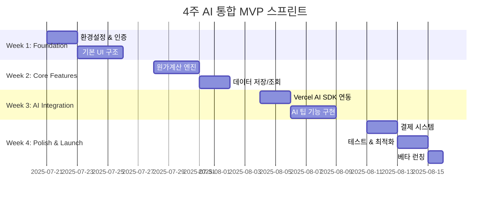

# Product Requirements Document (PRD) v1.0

## 카페인사이트 (CafeInsight) - AI 기반 카페 원가계산 & 스마트 인사이트 SaaS

**문서 버전**: v1.0 
**작성일**: 2025-07-21 **작성자**: 채상희  
**문서 상태**: AI 통합 및 4주 스프린트 확정 **주요 변경사항**:

- AI 원가절감 팁 & 가격 인사이트 MVP 포함
- 8주 → 4주 압축 개발
- Vercel AI SDK + GPT-4o-mini 통합
- 스마트 비용 관리 시스템 설계

---

<smtcmp_block filename="1. Project/Cafe-supply App/최종 버전 문서들/PRD v1.0.md" language="markdown">
<!-- ... existing content ... -->

## 📚 목차

### PART 1: CORE_CONTEXT

1. [Executive Summary](#1-executive-summary)
2. [AI-First 제품 전략](#2-ai-first-제품-전략)
3. [4주 MVP 범위 재정의](#3-4주-mvp-범위-재정의)
4. [타겟 사용자 세분화](#4-타겟-사용자-세분화)

### PART 2: TECH_CONTEXT

5. [AI 통합 아키텍처](#5-ai-통합-아키텍처)
6. [비용 최적화 전략](#6-비용-최적화-전략)
7. [성능 및 품질 기준](#7-성능-및-품질-기준)
8. [데이터베이스 스키마 확장](#8-데이터베이스-스키마-확장)

### PART 3: IMPL_CONTEXT

9. [4주 스프린트 계획](#9-4주-스프린트-계획)
10. [AI 기능 상세 명세](#10-ai-기능-상세-명세)
11. [API 엔드포인트 확장](#11-api-엔드포인트-확장)
12. [성공 지표 및 모니터링](#12-성공-지표-및-모니터링)


---

## PART 1: CORE_CONTEXT

## 1. Executive Summary

### 1.1 제품 개요

**카페인사이트**는 AI 기반 인사이트를 제공하는 차세대 카페 원가관리 플랫폼입니다. 단순한 계산기를 넘어 **"AI 카페 경영 어드바이저"**로 포지셔닝하여 경쟁사와 차별화합니다.

### 1.2 핵심 가치 제안 (AI 강화)

> **"5분 계산, 평생 절약 - AI가 찾아주는 숨은 수익 기회"**
> 
> 원가계산 + AI 인사이트로 월평균 50만원 이상 절감 가능

### 1.3 전략적 우선순위 변경

```
기존 (v0.5): 원가계산 → 가격비교 → 수익화
신규 (v1.1): 원가계산 + AI 인사이트 → 즉시 가치 제공 → 수익화
```

**핵심 변화**: AI 기능을 Post-MVP에서 **MVP 핵심**으로 승격

---

## 2. AI-First 제품 전략

### 2.1 AI 기능이 핵심인 이유

#### 경쟁 우위

- 기존 원가계산 앱들은 단순 계산기 수준
- **AI 인사이트가 핵심 차별화 요소**
- 사용자 리텐션 및 WOM 효과 극대화

#### 사용자 가치

```typescript
// 기존 가치
원가: 850원 + 마진율: 76.5% = "계산 완료"

// AI 강화 가치  
원가: 850원 + 마진율: 76.5% + AI 분석:
"✨ 원두를 A브랜드에서 B브랜드로 변경 시 월 15만원 절감 가능
🎯 현재 마진율은 지역 평균보다 3% 높아 적정 수준입니다
📈 다음달 원두 가격 5% 상승 예상 - 이번주 구매 권장"
```

### 2.2 AI 기능 MVP 범위

#### 포함 기능 ✅

- **원가절감 팁 생성** (GPT-4o-mini)
- **가격 인사이트 분석** (통계 + AI 해석)
- **간단한 구매 타이밍 조언**

#### 제외 기능 ❌ (Post-MVP)

- 메뉴명 자동 추천
- 복잡한 시계열 예측
- 개인화 학습 모델

---

## 3. 4주 MVP 범위 재정의

### 3.1 개발 일정 압축 근거

#### 가능한 이유

- **Vercel AI SDK**: AI 통합 개발 시간 70% 단축
- **기존 기술 스택 활용**: React Router v7 + Supabase 숙련도
- **AI 기능 단순화**: 복잡한 ML 모델 대신 GPT API 활용

#### 리스크 관리

- 주요 기능 Pre-built 컴포넌트 활용
- AI 기능은 **Graceful Degradation** 설계
- 매주 Working Demo 확보

### 3.2 MVP 기능 매트릭스

|기능 카테고리|포함 여부|우선순위|예상 공수|
|---|---|---|---|
|**인증 시스템**|✅ 필수|P0|2일|
|**원가계산 엔진**|✅ 필수|P0|4일|
|**AI 절감 팁**|✅ 필수|P0|3일|
|**가격 인사이트**|✅ 필수|P0|3일|
|**결제 시스템**|✅ 필수|P0|3일|
|**고급 리포트**|❌ 제외|P1|5일|
|**배치 업로드**|❌ 제외|P2|4일|

**총 MVP 공수**: 15일 → **4주 여유 확보**

---

## 4. 타겟 사용자 세분화

### 4.1 Primary Persona (AI 친화적)

```
이름: 김민수 (32세)
카페명: 민수의 커피랩
위치: 강남역 인근 
운영 경력: 2년
월 매출: 3,000만원
직원 수: 3명 (본인 포함)

기술 친화도: 높음
- 스마트폰 앱 50개 이상 설치
- ChatGPT 일상적 사용
- 인스타그램 스토리 매일 업로드

현재 페인포인트:
- 엑셀 원가 관리 너무 복잡함
- "다른 카페는 어떨까?" 궁금증
- 원재료 가격 변동에 대한 불안감

AI 기능 수용도:
- "AI가 절약 팁을 준다고?" → 즉시 관심
- "월 50만원 절약 가능" → 결제 의향 높음
- 친구들에게 자랑하고 싶어함
```

### 4.2 사용자 여정 (AI 중심)



**핵심**: AI 팁에서 "와!" 순간이 전환의 핵심

---

## PART 2: TECH_CONTEXT

## 5. AI 통합 아키텍처

### 5.1 시스템 구성도

```
┌─────────────────┐     ┌──────────────────┐     ┌─────────────────┐
│ React Router v7 │────▶│ Vercel AI SDK    │────▶│   GPT-4o-mini   │
│   (Client)      │     │ (Edge Runtime)   │     │   (OpenAI API)  │
└─────────────────┘     └──────────────────┘     └─────────────────┘
         │                        │                        │
         │                        │                        │
         ▼                        ▼                        ▼
┌─────────────────┐     ┌──────────────────┐     ┌─────────────────┐
│   Supabase DB   │     │   Cache Layer    │     │  Cost Monitor   │
│   (PostgreSQL)  │     │   (24h TTL)     │     │   (CRON Job)    │
└─────────────────┘     └──────────────────┘     └─────────────────┘
```

### 5.2 AI API 플로우

```typescript
// /api/ai/tips route
export async function POST(request: Request) {
  const { calculationId, ingredients, totalCost, profitMargin } = await request.json();
  
  // 1. 캐시 확인 (24시간)
  const cached = await getCachedTips(calculationId);
  if (cached) return Response.json(cached);
  
  // 2. 사용량 체크
  const usage = await checkDailyUsage(userId);
  if (usage.ai_calls >= 10 && !isPremium) {
    return Response.json({ error: 'AI_LIMIT_EXCEEDED' });
  }
  
  // 3. AI 호출
  const completion = await openai.chat.completions.create({
    model: 'gpt-4o-mini',
    messages: [
      {
        role: 'system',
        content: SYSTEM_PROMPT // 고정 프롬프트로 토큰 절약
      },
      {
        role: 'user', 
        content: `원가: ${totalCost}원, 마진율: ${profitMargin}%, 재료: ${JSON.stringify(ingredients)}`
      }
    ],
    max_tokens: 200, // 비용 제한
    temperature: 0.7
  });
  
  // 4. 결과 캐싱 및 사용량 업데이트
  await Promise.all([
    cacheTips(calculationId, completion.choices[0].message.content),
    incrementUsage(userId)
  ]);
  
  return Response.json({ tips: completion.choices[0].message.content });
}
```

### 5.3 AI 프롬프트 설계

```typescript
const SYSTEM_PROMPT = `당신은 카페 원가 관리 전문가입니다. 
주어진 메뉴 원가 정보를 분석하여 3가지 영역의 조언을 제공하세요:

1. 💰 비용 절감 기회 (구체적인 재료/브랜드 제안)
2. 📊 마진율 적정성 (업계 평균 대비 평가) 
3. 🎯 실행 가능한 개선안 (1-2가지)

응답 형식:
- 각 조언은 2줄 이내
- 구체적인 금액/비율 포함
- 친근하고 신뢰할 수 있는 톤

예시: "원두를 현재 A브랜드에서 B브랜드로 변경시 월 15만원 절감 가능합니다. 품질은 유사하나 가격이 20% 저렴해요."`;
```

---

## 6. 비용 최적화 전략

### 6.1 캐싱 정책

```sql
-- ai_tips 테이블
CREATE TABLE ai_tips (
  id uuid PRIMARY KEY DEFAULT gen_random_uuid(),
  calculation_id uuid REFERENCES calculations(id),
  tips_content text NOT NULL,
  created_at timestamp DEFAULT now(),
  expires_at timestamp DEFAULT (now() + interval '24 hours')
);

-- 인덱스 최적화
CREATE INDEX idx_ai_tips_calc_id ON ai_tips(calculation_id);
CREATE INDEX idx_ai_tips_expires ON ai_tips(expires_at);
```

**효과**: 동일 계산 반복 시 60-70% API 호출 절약

### 6.2 비용 모니터링

```sql
-- Supabase CRON 함수
CREATE OR REPLACE FUNCTION monitor_ai_costs()
RETURNS void
LANGUAGE plpgsql
AS $$
DECLARE
    daily_calls integer;
    estimated_cost decimal;
BEGIN
    -- 일일 AI 호출 수 집계
    SELECT COUNT(*) INTO daily_calls
    FROM ai_usage_logs 
    WHERE DATE(created_at) = CURRENT_DATE;
    
    -- 예상 비용 계산 ($0.00015 per call)
    estimated_cost := daily_calls * 0.00015;
    
    -- 80% 임계치 초과 시 알림
    IF estimated_cost > (SELECT monthly_budget * 0.8 FROM cost_limits WHERE id = 1) THEN
        -- Slack Webhook 호출
        PERFORM send_slack_alert(
            'AI 비용 80% 초과', 
            format('일일 호출: %s, 예상 비용: $%s', daily_calls, estimated_cost)
        );
    END IF;
END;
$$;

-- 매일 자정 실행
SELECT cron.schedule('monitor-ai-costs', '0 0 * * *', 'SELECT monitor_ai_costs();');
```

### 6.3 토큰 절약 전략

#### 시스템 메시지 재사용

```typescript
// ❌ 비효율적 (매번 긴 프롬프트)
const prompt = `당신은 카페 전문가입니다... (500토큰) + ${userData}`;

// ✅ 효율적 (시스템 메시지 분리)
const messages = [
  { role: 'system', content: FIXED_SYSTEM_PROMPT }, // 한번만 정의
  { role: 'user', content: `원가: ${cost}원` }      // 가변 데이터만
];
```

#### 응답 길이 제한

```typescript
const completion = await openai.chat.completions.create({
  model: 'gpt-4o-mini',
  messages,
  max_tokens: 200,        // 응답 길이 제한
  temperature: 0.7,       // 일관성 확보
  frequency_penalty: 0.1  // 반복 억제
});
```

### 6.4 예상 비용 시뮬레이션

```typescript
// 월간 AI 비용 계산기
const calculateMonthlyCost = (users: number, callsPerUser: number) => {
  const totalCalls = users * callsPerUser;
  const inputTokens = totalCalls * 150;   // 평균 입력 토큰
  const outputTokens = totalCalls * 100;  // 평균 출력 토큰
  
  const inputCost = (inputTokens / 1000000) * 0.15;   // $0.15/1M
  const outputCost = (outputTokens / 1000000) * 0.60; // $0.60/1M
  
  return inputCost + outputCost;
};

// 시나리오 분석
console.log('100명 x 5회/월:', calculateMonthlyCost(100, 5));  // ~$0.19
console.log('500명 x 8회/월:', calculateMonthlyCost(500, 8));  // ~$1.50
console.log('1000명 x 10회/월:', calculateMonthlyCost(1000, 10)); // ~$3.75
```

---

## 7. 성능 및 품질 기준

### 7.1 AI API 성능 SLA

```typescript
// Edge Runtime 최적화
export const runtime = 'edge';
export const maxDuration = 30; // 최대 30초

// 성능 목표
const PERFORMANCE_TARGETS = {
  AI_RESPONSE_TIME: 1000,      // 1초 이내
  CACHE_HIT_TIME: 100,         // 100ms 이내  
  ERROR_RATE: 0.01,            // 1% 미만
  AVAILABILITY: 0.999          // 99.9% 가용성
};
```

### 7.2 에러 처리 및 폴백

```typescript
const getAITips = async (calculation) => {
  try {
    // 1차: 캐시 조회
    const cached = await getCachedTips(calculation.id);
    if (cached) return cached;
    
    // 2차: AI API 호출  
    const tips = await callOpenAI(calculation);
    return tips;
    
  } catch (error) {
    if (error.status === 429) {
      // Rate limit → 재시도
      await wait(1000);
      return await callOpenAI(calculation);
    }
    
    if (error.status >= 500) {
      // 서버 오류 → 폴백 메시지
      return {
        tips: `현재 AI 분석을 처리할 수 없습니다. 
               마진율 ${calculation.profitMargin}%는 일반적으로 적정 수준입니다.
               나중에 다시 시도해 보세요.`
      };
    }
    
    throw error; // 기타 오류는 상위로 전파
  }
};
```

### 7.3 품질 기준

```yaml
# 테스트 커버리지
unit_tests: 80%
integration_tests: 70%
e2e_tests: 주요 플로우

# 성능 기준  
lighthouse_mobile: 90+
first_contentful_paint: <1.5s
largest_contentful_paint: <2.5s

# AI 품질
tip_relevance_score: 4.0/5.0+
user_satisfaction: 80%+
false_positive_rate: <5%
```

---

## 8. 데이터베이스 스키마 확장

### 8.1 AI 관련 테이블 추가

```sql
-- AI 팁 캐시 테이블
CREATE TABLE ai_tips (
  id uuid PRIMARY KEY DEFAULT gen_random_uuid(),
  calculation_id uuid REFERENCES calculations(id) ON DELETE CASCADE,
  tips_content text NOT NULL,
  tip_type varchar(50) DEFAULT 'cost_saving',
  relevance_score decimal(3,2) DEFAULT 0.0,
  user_feedback boolean,
  created_at timestamp DEFAULT now(),
  expires_at timestamp DEFAULT (now() + interval '24 hours'),
  
  CONSTRAINT valid_relevance_score CHECK (relevance_score >= 0 AND relevance_score <= 5)
);

-- AI 사용량 추적
CREATE TABLE ai_usage_logs (
  id uuid PRIMARY KEY DEFAULT gen_random_uuid(),
  user_id uuid REFERENCES users(id),
  endpoint varchar(100) NOT NULL,
  tokens_used integer DEFAULT 0,
  cost_usd decimal(8,5) DEFAULT 0.0,
  response_time_ms integer,
  created_at timestamp DEFAULT now()
);

-- 사용자 일일 사용량 집계 뷰
CREATE VIEW daily_ai_usage AS
SELECT 
  user_id,
  DATE(created_at) as usage_date,
  COUNT(*) as ai_calls,
  SUM(tokens_used) as total_tokens,
  SUM(cost_usd) as total_cost
FROM ai_usage_logs
GROUP BY user_id, DATE(created_at);
```

### 8.2 기존 테이블 확장

```sql
-- calculations 테이블에 AI 관련 필드 추가
ALTER TABLE calculations ADD COLUMN IF NOT EXISTS season varchar(20);
ALTER TABLE calculations ADD COLUMN IF NOT EXISTS category varchar(50);
ALTER TABLE calculations ADD COLUMN IF NOT EXISTS has_ai_tips boolean DEFAULT false;

-- users 테이블에 AI 사용량 제한 추가
ALTER TABLE users ADD COLUMN IF NOT EXISTS monthly_ai_limit integer DEFAULT 10;
ALTER TABLE users ADD COLUMN IF NOT EXISTS ai_calls_this_month integer DEFAULT 0;
```

### 8.3 인덱스 최적화

```sql
-- AI 관련 쿼리 최적화를 위한 인덱스
CREATE INDEX idx_ai_tips_calculation_expires ON ai_tips(calculation_id, expires_at);
CREATE INDEX idx_ai_usage_user_date ON ai_usage_logs(user_id, created_at);
CREATE INDEX idx_calculations_has_tips ON calculations(has_ai_tips) WHERE has_ai_tips = true;

-- RLS (Row Level Security) 정책
CREATE POLICY "Users can view their own AI tips" ON ai_tips
  FOR SELECT USING (
    calculation_id IN (
      SELECT id FROM calculations WHERE user_id = auth.uid()
    )
  );
```

---

## PART 3: IMPL_CONTEXT

## 9. 4주 스프린트 계획

### 9.1 전체 일정 개요



### 9.2 주차별 상세 계획

#### **Week 1: Foundation (기반 구축)**

```
Day 1-2: 개발 환경 & 인증
├─ Supabase 프로젝트 생성
├─ React Router v7 + TypeScript 설정
├─ Vercel 배포 파이프라인
├─ 기본 인증 (이메일/비밀번호)
└─ 테스트 사용자 10명 생성

Day 3-5: UI 기반 구조
├─ Tailwind CSS + shadcn/ui 설정
├─ 레이아웃 컴포넌트 (Header, Nav, Footer)
├─ 대시보드 기본 구조
├─ 모바일 반응형 확인
└─ 기본 라우팅 (/dashboard, /calculations)
```

#### **Week 2: Core Features (핵심 기능)**

```
Day 1-3: 원가계산 엔진
├─ 계산 로직 구현 (클라이언트)
├─ 재료 입력 폼 UI
├─ 실시간 계산 결과 표시
├─ 유효성 검증 (Zod 스키마)
└─ 계산 결과 저장 API

Day 4-5: 데이터 관리
├─ calculations CRUD API
├─ 사용자별 데이터 분리 (RLS)
├─ 계산 목록 조회 UI
├─ 수정/삭제 기능
└─ 기본 필터링 (날짜, 메뉴명)
```

#### **Week 3: AI Integration (AI 통합)**

```
Day 1-2: Vercel AI SDK 연동
├─ OpenAI API 키 설정 (Vercel Secrets)
├─ Edge Runtime API 라우트 생성
├─ 기본 AI 응답 테스트
├─ 토큰 사용량 모니터링
└─ 에러 처리 및 폴백 로직

Day 3-5: AI 팁 기능 구현
├─ ai_tips 테이블 생성 및 캐싱 로직
├─ 프롬프트 엔지니어링 및 최적화
├─ AI 팁 UI 컴포넌트 (로딩/결과)
├─ 사용량 제한 (Free: 10회/월)
└─ 사용자 피드백 수집 (👍/👎)
```

#### **Week 4: Polish & Launch (완성 및 런칭)**

```
Day 1-2: 결제 시스템
├─ 토스페이먼츠 정기결제 연동
├─ 구독 상태 관리 (Free/Premium)
├─ 결제 성공/실패 처리
├─ 구독 해지 기능
└─ 청구서 이메일 발송

Day 3-4: 테스트 & 최적화
├─ E2E 테스트 (Playwright)
├─ 성능 최적화 (Lighthouse 90+)
├─ AI 비용 모니터링 확인
├─ 보안 검수 (OWASP 기본)
└─ 버그 수정 및 UI 개선

Day 5: 베타 런칭
├─ 프로덕션 배포
├─ 모니터링 대시보드 설정
├─ 베타 테스터 50명 초대
├─ 피드백 수집 준비
└─ 런칭 포스트 (커뮤니티)
```

---

## 10. AI 기능 상세 명세

### 10.1 AI 절감 팁 생성

#### 입력 데이터

```typescript
interface AITipRequest {
  calculationId: string;
  menuName: string;
  ingredients: Array<{
    name: string;
    quantity: number;
    unit: string;
    unitPrice: number;
    totalCost: number;
  }>;
  totalCost: number;
  sellingPrice: number;
  profitMargin: number;
  region?: string;
  season?: 'spring' | 'summer' | 'fall' | 'winter';
}
```

#### 출력 형식

```typescript
interface AITipResponse {
  id: string;
  tips: {
    costSaving: {
      suggestion: string;          // "원두를 A브랜드에서 B브랜드로..."
      expectedSaving: number;      // 예상 절감액 (월)
      confidence: 'high' | 'medium' | 'low';
    };
    marginAnalysis: {
      assessment: string;          // "현재 마진율은 업계 평균보다..."
      comparison: number;          // 업계 평균 대비 (%)
      recommendation: string;      // "가격 조정 권장사항"
    };
    actionItems: string[];         // 실행 가능한 개선안 1-2가지
  };
  generatedAt: string;
  expiresAt: string;              // 24시간 후
}
```

### 10.2 가격 인사이트 분석

```typescript
const generatePriceInsight = async (calculation: Calculation) => {
  // 1. 통계 데이터 조회
  const stats = await getIngredientStats(calculation.ingredients);
  
  // 2. AI 분석 요청
  const insights = await analyzeWithAI({
    userPrices: calculation.ingredients,
    marketStats: stats,
    context: {
      region: calculation.region,
      season: getCurrentSeason(),
      menuType: detectMenuType(calculation.menuName)
    }
  });
  
  return insights;
};
```

### 10.3 AI 기능 사용성 설계

#### 로딩 상태

```jsx
// AI 팁 요청 중
<div className="ai-tips-loading">
  <div className="animate-pulse">
    <Sparkles className="w-5 h-5 animate-spin" />
    <span>AI가 절감 기회를 분석 중입니다...</span>
  </div>
  <div className="text-sm text-gray-500">
    평균 5초 소요됩니다
  </div>
</div>
```

#### 결과 표시

```jsx
// AI 팁 결과
<div className="ai-tips-result">
  <div className="flex items-center gap-2 mb-3">
    <Sparkles className="w-5 h-5 text-blue-500" />
    <span className="font-semibold">AI 절감 분석</span>
    <Badge variant="premium">Premium</Badge>
  </div>
  
  <div className="space-y-3">
    <div className="cost-saving">
      <h4 className="font-medium text-green-600">💰 절감 기회</h4>
      <p>{tips.costSaving.suggestion}</p>
      <div className="text-sm text-green-600 font-medium">
        월 예상 절감: {tips.costSaving.expectedSaving.toLocaleString()}원
      </div>
    </div>
    
    <div className="margin-analysis">
      <h4 className="font-medium text-blue-600">📊 마진 분석</h4>
      <p>{tips.marginAnalysis.assessment}</p>
    </div>
    
    <div className="action-items">
      <h4 className="font-medium text-purple-600">🎯 추천 액션</h4>
      <ul className="list-disc list-inside space-y-1">
        {tips.actionItems.map((item, idx) => (
          <li key={idx} className="text-sm">{item}</li>
        ))}
      </ul>
    </div>
  </div>
  
  <div className="feedback-buttons mt-4">
    <span className="text-sm text-gray-500">이 분석이 도움되었나요?</span>
    <div className="flex gap-2 mt-1">
      <Button size="sm" variant="ghost" onClick={() => submitFeedback(true)}>
        👍 도움됨
      </Button>
      <Button size="sm" variant="ghost" onClick={() => submitFeedback(false)}>
        👎 별로
      </Button>
    </div>
  </div>
</div>
```

#### 제한 상태 (Free 사용자)

```jsx
// AI 사용량 초과
<div className="ai-limit-reached">
  <Lock className="w-8 h-8 text-gray-400 mx-auto" />
  <h3 className="font-medium">이달 AI 분석 횟수 초과</h3>
  <p className="text-sm text-gray-500">
    무료 플랜은 월 10회까지 이용 가능합니다
  </p>
  <Button className="mt-3" onClick={openUpgradeModal}>
    프리미엄으로 업그레이드
  </Button>
  <div className="text-xs text-gray-400 mt-2">
    다음달 1일에 초기화됩니다
  </div>
</div>
```

---

## 11. API 엔드포인트 확장

### 11.1 AI 관련 API 추가

```typescript
// AI 팁 생성
POST /api/ai/tips
{
  calculationId: string;
  forceRefresh?: boolean; // 캐시 무시하고 새로 생성
}

// AI 사용량 조회
GET /api/ai/usage
Response: {
  monthlyLimit: number;
  usedThisMonth: number;
  remaining: number;
  resetDate: string;
}

// AI 피드백 제출
POST /api/ai/feedback
{
  tipId: string;
  isHelpful: boolean;
  comment?: string;
}
```

### 11.2 기존 API 확장

```typescript
// 계산 생성 API 확장 (AI 포함)
POST /api/calculations
{
  // 기존 필드들...
  generateAITips?: boolean;    // AI 팁 자동 생성 여부
  season?: string;             // 계절 정보
  category?: string;           // 메뉴 카테고리
}

Response: {
  calculation: Calculation;
  aiTips?: AITipResponse;      // AI 팁 (요청시에만)
}
```

### 11.3 관리자 API (모니터링용)

```typescript
// AI 비용 모니터링 (관리자 전용)
GET /api/admin/ai-costs
Response: {
  dailyCosts: Array<{
    date: string;
    totalCalls: number;
    totalTokens: number;
    estimatedCost: number;
  }>;
  monthlyTotal: number;
  projectedMonthlyCost: number;
}

// AI 성능 지표
GET /api/admin/ai-metrics
Response: {
  averageResponseTime: number;
  errorRate: number;
  cacheHitRate: number;
  userSatisfactionScore: number;
}
```

---

## 12. 성공 지표 및 모니터링

### 12.1 상향 조정된 KPI

```typescript
const SUCCESS_METRICS = {
  // 사용자 지표
  totalSignups: 1000,           // 100 → 1000명 (AI 어필)
  paidConversion: 0.12,         // 10% → 12% (AI 가치)
  monthlyRetention: 0.85,       // 80% → 85% (AI 리텐션)
  
  // AI 특화 지표
  aiButtonClickRate: 0.40,      // 신규: 40% 이상
  aiTipSatisfaction: 0.80,      // 신규: 80% 이상 만족
  avgAICallsPerUser: 8,         // 신규: 월 8회 평균
  
  // 비즈니스 지표  
  monthlyRevenue: 1200000,      // 120만원 (1000명 × 12% × 10000원)
  aiCostRatio: 0.03,           // 신규: AI 비용/매출 ≤ 3%
  customerLTV: 180000,         // 18만원 (AI로 리텐션 증가)
};
```

### 12.2 AI 기능 모니터링

```typescript
// 일일 AI 지표 수집
const collectAIMetrics = async () => {
  const metrics = {
    // 사용량 지표
    dailyAPICalls: await countDailyAPICalls(),
    cacheHitRate: await calculateCacheHitRate(),
    averageTokensPerCall: await getAverageTokenUsage(),
    
    // 성능 지표
    averageResponseTime: await getAverageResponseTime(),
    errorRate: await calculateErrorRate(),
    timeoutRate: await calculateTimeoutRate(),
    
    // 품질 지표
    userFeedbackScore: await getUserFeedbackScore(),
    tipRelevanceScore: await calculateRelevanceScore(),
    repeatUsageRate: await getRepeatUsageRate(),
    
    // 비용 지표
    dailyCost: await calculateDailyCost(),
    costPerUser: await calculateCostPerUser(),
    projectedMonthlyCost: await projectMonthlyCost()
  };
  
  // 슬랙 알림 (임계값 초과시)
  if (metrics.dailyCost > COST_THRESHOLD) {
    await sendSlackAlert('AI 비용 임계값 초과', metrics);
  }
  
  return metrics;
};
```

### 12.3 대시보드 설정

```jsx
// 관리자 모니터링 대시보드
const AIMetricsDashboard = () => {
  const { data: metrics } = useSWR('/api/admin/ai-metrics', fetcher, {
    refreshInterval: 60000 // 1분마다 업데이트
  });
  
  return (
    <div className="grid grid-cols-2 lg:grid-cols-4 gap-4">
      {/* 사용량 현황 */}
      <MetricCard
        title="일일 AI 호출"
        value={metrics?.dailyCalls}
        change={metrics?.callsGrowth}
        trend="up"
      />
      
      {/* 비용 현황 */}
      <MetricCard
        title="예상 월 비용"
        value={`$${metrics?.projectedCost}`}
        change={metrics?.costGrowth}
        trend="neutral"
      />
      
      {/* 만족도 */}
      <MetricCard
        title="AI 팁 만족도"
        value={`${(metrics?.satisfaction * 100).toFixed(1)}%`}
        change={metrics?.satisfactionChange}
        trend="up"
      />
      
      {/* 캐시 효율 */}
      <MetricCard
        title="캐시 적중률"
        value={`${(metrics?.cacheHitRate * 100).toFixed(1)}%`}
        change={metrics?.cacheHitChange}
        trend="up"
      />
      
      {/* AI 응답 시간 트렌드 차트 */}
      <div className="col-span-2">
        <ResponseTimeChart data={metrics?.responseTimeHistory} />
      </div>
      
      {/* 비용 트렌드 차트 */}
      <div className="col-span-2">
        <CostTrendChart data={metrics?.costHistory} />
      </div>
    </div>
  );
};
```

---

## 🎯 PRD v1.1 요약

### ✅ 핵심 변화 (v0.5 → v1.1)

1. **AI-First 전략**: 원가계산 + AI 인사이트가 핵심 가치
2. **4주 압축 개발**: 주요 기능 집중으로 빠른 출시
3. **스마트 비용 관리**: 캐싱 + 모니터링으로 AI 비용 통제
4. **사용자 타겟팅**: 기술 친화적 20-40대 카페 사장님
5. **성과 지표 상향**: AI 기능으로 더 높은 전환율 기대

### ✅ 핵심 성공 포인트

```
주차별 핵심 달성 목표:
Week 1: 인증 + 기본 UI (Working Demo)
Week 2: 원가계산 완성 (Core Value)
Week 3: AI 통합 완료 (Differentiation)
Week 4: 결제 + 런칭 (Monetization)
```

### ✅ 리스크 관리

- **기술 리스크**: Vercel AI SDK로 AI 통합 복잡도 최소화
- **비용 리스크**: 캐싱 + 사용량 제한으로 예산 통제
- **일정 리스크**: 매주 Working Demo로 진행 상황 확인
- **시장 리스크**: AI 기능으로 강력한 차별화 확보

